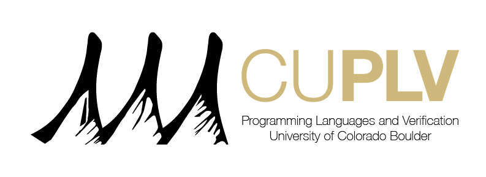

# Position: Grading and Course Assistant Positions for Compiler Construction

## Job Description

Prof. Bor-Yuh Evan Chang is looking for a undergraduate or graduate grading assistants and course assistants for CSCI 4555/5525 Compiler Construction.

In the grading assistant role, your primary responsibility will be to grade student projects through interview grading. In the course assistant role, your primary responsibility will be to tutor and develop course content.

The position is for undergraduate or graduate students and is part-time (number of hours to be determined). Pay rate will follow the department's standard pay scale.

Please apply, if you possess the following:

  - Taken an undergraduate or graduate course on compiler construction.
  
If you possess any of the following skills which we highly value, you will have an advantage:

  - Experience in interview grading.
  - Experience in development in public repositories (e.g., GitHub, BitBucket).
  - Teaching experience.

To apply, send your resume or CV, your (informal) transcript with a grade for compiler construction, and the solution to the following interview exercise to Prof. Bor-Yuh Evan Chang <evan.chang@colorado.edu>.

Submissions received by 8:00am on Monday, August 21, 2017 will receive full consideration, but the position will remain open until filled.

## Interview Exercise

### Introduction

In order to assess your background knowledge and assessment experience, we ask you to develop a basic interpreter (described below) to be submitted as part of your application.

While we welcome and appreciate (extra fancy features) to what we have specified, it is more important that you present your ideas well and ensure that you have included concise write up of your solution. If you are selected for an interview, we are excited and want to hear about how you approached this exercise!

### Implementation Exercise

A fundamental concept in language implementation is manipulating abstract syntax. To demonstrate mastery of this concept, we would like a basic interpreter for arithmetic expressions in a subset of Python. The syntax of the subset of interest is defined as follows:

```
  statements  s ::=  x = e  |   print e  | s s
  expressions e ::=  x  |  n  |  e + e  |  e - e  |  e * e  | e / e
  variables   x
  integers    n
```

An example program in this language is given in [ex1.py].

[ex1.py]: 2017-4555-grader/ex1.py

Your interpreter should behave like the Python interpreter.

The core of the exercise is how you structure and implement your interpreter. Feel free to use any libraries to parse your input. You may implement your interpreter in the programming language of your choice.

### Assessment Exercise

Now we would like to assess another student's solution to this exercise. Imagine your role as a grader for the above implementation exercise.

- Write one question for an oral interview to try to assess a student's mastery of the core concept behind the above implementation exercise. 
- Then, describe aspects of a response that would correspond to mastery versus acceptable understanding versus insufficient understanding.

### Acceptance Criteria

_Please adhere to the following criteria_:

  - Development: Please develop in a public GitHub repository with CI tests (e.g., Travis CI). You may use any implementation language. And you should have sufficient tests to demonstrate confidence in your solution.

  - Documentation: Once again, we value your ability to communicate with others. This includes the ability to explain to others how to use your work.
  
### Submission

We will evaluate the proposed solution by testing its execution and by inspecting the source code and its documentation. Please submit a link to your GitHub repo with your implementation, your tests, your response to the assessment exercise, and some additional documentation to understand your submission.

### Guidance

Don't over-complicate it. Use any libraries that help you achieve the exercise. Don’t worry about production-level error reporting. The focus is on evaluating your thought process and documenting any potential future issues.

It is ok to send us an e-mail if you have any questions.
